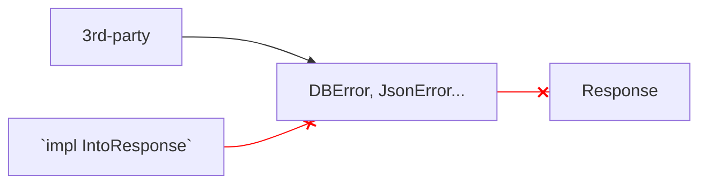
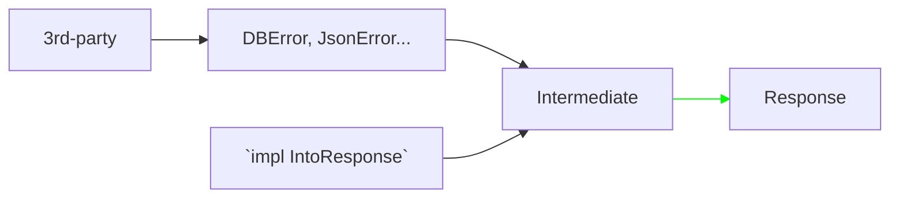

# Before Rust

## C

```c
FILE *fp;
errno = 0;   // Must do before calling
fp = fopen("Nofile", "r");
if (errno != 0) {  // Must follow right after calling
  perror("Error occurred while opening file.\n");
  exit(1);
}
```

`errno` is implicitly global, shared with many function calls.

---
transition: fade-out
---

# Rust

```rust
match sensor.single_measurement() {
  Ok(t) => {
    info!("Measurement: {t:?}");
    message.temperature = Some(t.temperature);
    message.humidity = Some(t.humidity);
  }
  Err(embedded_sht3x::Error::BadCrc) => {
    warn!("Error reading SHT3x: Bad CRC.");
  }
  Err(embedded_sht3x::Error::I2c(e)) => {
    warn!("Error reading SHT3x: {}.", e.cause());
  }
};
```

where

```rust
fn single_measurement(&mut self) -> Result<Measurement, embedded_sht3x::Error>
```

---

# Result type

Function which can fail will return a `Result`.

<div class='text-4xl text-center font-mono text-gray-600 -translate-x-16'>
  <span>Result<</span><span class='text-green-600'>T</span><span>,</span><span class='text-red-600'>E</span><span>></span>
</div>

<div class='grid grid-cols-2 gap-4'>
  <div class='text-right text-green-600'>Type of value when function succeeded.</div>
  <div class='text-red-600'>Type of value when function failed.</div>
</div>

Examples:

```rust
u8::from_str("2") -> Ok(2)
```

```rust
u8::from_str("z") -> Err(e)  // where e is of std::num::ParseIntError type
```

`E`{.text-red-500} can be any type, but normally a type that implements `std::error::Error`{.text-purple-700 .font-mono} trait, to be convenient for chaining (`E1` caused by `E2`, which is caused by `E3`, which is caused by `E4` etc.).

<style>
.slidev-code {
  --slidev-code-font-size: 1rem;
}
</style>

---
hideInToc: true
---

# Result type

Want to ignore error?


---
transition: fade-out
---

# Exception style vs Rust style


| [Exception handling]{.text-blue .font-bold} | [Rust error handling]{.text-amber-700 .font-bold} |
|------------------------------------|-----------------------|
| Quicker to have a demo code        | Need to think more, have to write more before running |
| When being serious, take more time to discover what error can happen  | Quickly see possible errors before actual running |

---

# Is Rust style verbose?

```rust
fn parent_function() -> Result<Post, AppError> {
  let r1 = child_1();  // -> Result, have to handle
  if r1.is_err() {
    return r1;
  }
  let r2 = child_2();    // -> Result, have to handle
  let db = match r2 {
    Ok(x) => x,
    Err(e) => return Err(AppError::from(e)),
  }
  child_3(db)
}
```

Is it too verbose?

No, Rust has a very handy `?`{.text-green-600 .font-bold style='font-weight: 700; font-size: 1.1rem'} operator.


---
hideInToc: true
---

# Is Rust style verbose?

<div class='grid grid-cols-2 gap-4'>
<div>

```rust
fn parent_function() -> Result<Post, AppError> {
  let r1 = child_1();
  if r1.is_err() {
    return r1;
  }
  let r2 = child_2();
  let db = match r2 {
    Ok(x) => x,
    Err(e) => return Err(AppError::from(e)),
  }
  child_3(db)
}
```

</div>
<div>

```rust
fn parent_function() -> Result<Post, AppError> {
  child_1()?;
  let db = child_2()?;
  child_3(db)
}
```

`?`{.font-mono .text-blue-700 .dark:text-blue-400} helps:

- Stop the function early when encountering error, returning that error.
- Unwrap the `Ok`{.font-mono .text-green-700 .dark:text-green-400}, getting the inner value.
- Convert child function's error to parent function error type (if one of them implement `From`/`Into` trait).

</div>
</div>

---
hideInToc: true
---

# Is Rust style verbose?

<hr class='pb-8 border-0' />

`?`{.font-mono .text-blue-700} is also handy in nested function calls which return `Option`.

```rust
fn parent_function() -> Option<Post> {
  child_1()?;
  let db = child_2()?;
  child_3(db)
}
```

_Tips_: Use `.ok()` to convert `Result<T,E>` to `Option<T>`.

<style>
.slidev-code {
  --slidev-code-font-size: 1rem;
}
</style>

---
hideInToc: true
---

# Is Rust style verbose?

Vs contemporary languages

<div class='grid grid-cols-2 gap-4'>
<div>

```go
func FindAndSetUserAge(username string, age int) error {
  var user *User
  var err error

  user, err = FindUser(username)
  if err != nil {
      return fmt.Errorf("FindAndSetUserAge: %w", err)
  }

  if err = SetUserAge(user, age); err != nil {
      return fmt.Errorf("FindAndSetUserAge: %w", err)
  }

  return nil
}

// Code copied from https://earthly.dev/blog/golang-errors/
```

</div>
<div>

```rust
fn find_and_set_user_age(username: String, age: u8)
-> Result<(), MyError> {
  let user = find_user(username)?;
  set_user_age(user, age)
}
```

</div>
</div>


---

# Apply in web development

<hr class='pb-8 border-0' />

To generate a response for a web request, server may have to do these steps, each is prone to error:

- Check if user has been logged in ➜ error when reading session from Redis or file.
- Fetch data from a database management system ➜ error if schema does not match application code, or misconfiguration.
- Process, compute the data before returning to user ➜ error if data is not in expected format, or some computation failed.
- Use template engine to render HTML ➜ error if template file path is wrong, or template code does not match data shape.

---
hideInToc: true
---

# Apply in web development

<hr class='pb-8 border-0' />

Every errors above, if not catched and handled properly, can lead to:

- Blank page, or ambiguous message ("[internal server error]{.text-gray-500}", "[connection reset]{.text-gray-500}").
- Server crash.

<hr class='mt-16 border-0' />
<carbon-checkmark-filled class='text-green-600 mr-2' />Should:

- Show a friendly message to user, and keep standard UI.
- Log the error for developer to understand context and fix.
- Keep server running, serving other requests.

---
hideInToc: true
---

# Apply in web development

<hr class='pb-8 border-0' />

To archive that, we should make web handler function return `Result`{.font-mono .text-blue-700 .dark:text-blue-400}, where:

| `Ok`{.font-mono .text-green-700} | `Err`{.font-mono .text-red-700} |
|-------------------------|------------------------------------------|
| `200 OK`, `201 Created` | `400 Bad Request`, `403 Forbidden`, <br> `500 Internal Server Error`
| Successful response | Error response |

...and use `?`{.font-mono .text-blue-700 .dark-text-blue-400} operator to have shorter code, and return error early.

<br>

Fortunately, most Rust web framework supports this style.

---

# Example with Axum

<div class='grid grid-cols-3 gap-4'>

<div class='col-span-2'>

```rust
use http::StatusCode;
use axum::response::{Html, ErrorResponse};
use crate::types::PageError;

pub async fn show_post(
	// Params...
) -> Result<Html<String>, ErrorResponse> {
	// Code...
	let post = get_detailed_post_by_slug(slug, &db)
        .await
        .map_err(PageError::EdgeDBQueryError)?
        .ok_or((StatusCode::NOT_FOUND, "No post at this URL"))?;
	// Code...
}
```

<Arrow x1='386' y1='284' x2='300' y2='230' width='1' color='rgb(99, 102, 241)' />
<Arrow x1='512' y1='302' x2='300' y2='230' width='1' color='rgb(99, 102, 241)' />

where

```rust
async fn get_detailed_post_by_slug(slug: String, client: &Client)
-> Result<Option<DetailedBlogPost>, edgedb_tokio::Error>
```

</div>

<div>

- `edgedb_tokio::Error` does not implement `IntoResponse`{.text-yellow-700 .dark:text-yellow-500} trait.

  🡆 Use `map_err`{.text-blue-500} to convert it to `PageError`.

- "No data" is commonly treated as error.

  🡆 Use `ok_or`{.text-blue-500} to convert `None`{.text-gray-500 .dark:text-gray-300} to `Err`{.text-red-500} (`Option` to `Result`).

- `(StatusCode, "string")` tuple implements `IntoResponse`{.text-yellow-700 .dark:text-yellow-500} trait.


</div>

</div>

---
hideInToc: true
---

# Example with Axum

Bridge third-party libraries





*Tips*: Define intermediate error type as `enum` and use `thiserror` to write less code.

---
hideInToc: true
---

# Example with Axum

<hr class='pb-8 border-0' />

Intermediate error type is also convenient for scenario:

My website serves two types of audience:

- Normal user ⬿ Error response should be HTML.
- API client ⬿ Error response should be JSON.

Define:

- `PageError`, whose `into_response()` generates HTML response.
- `ApiError`, whose `into_response()` generates JSON response.

---
hideInToc: true
---

# Example with Axum

<div class='grid grid-cols-2 gap-4'>
<div>

```rust
#[derive(Debug, thiserror::Error)]
pub enum PageError {
    #[error(transparent)]
    EdgeDBQueryError(#[from] edgedb_errors::Error),
    #[error(transparent)]
    JinjaError(#[from] minijinja::Error),
}

impl IntoResponse for PageError {
    fn into_response(self) -> Response {
        // Code to create response for each case of error
        (status, message).into_response()
    }
}
```

</div>
<div>

```rust
#[derive(Debug, thiserror::Error)]
pub enum ApiError {
    #[error(transparent)]
    EdgeDBQueryError(#[from] edgedb_errors::Error),
    #[error("{0} not found")]
    ObjectNotFound(String),
    #[error("Please login")]
    Unauthorized,
    #[error(transparent)]
    ValidationErrors(#[from] validify::ValidationErrors),
}

impl IntoResponse for ApiError {
    fn into_response(self) -> axum::response::Response {
        // Code to create response for each case of error.
        (status, axum::Json(payload)).into_response()
    }
}
```

</div>
</div>